# FaultFalcon: an example investigation

A complete demo run on incident **INC-001**, captured from the app on a laptop CPU with the fine-tuned
model (`smollm2-360m-ff-chat`). It shows how an alert on one service is traced, across two dependencies,
to the deployment and the single line of code that caused it.

> FaultFalcon is a **prototype in development**. The platform, its changes and most of its logs are
> simulated so that every incident has a known answer; see the [README](README.md#the-data).

**The incident:** `billing-svc` (the service that bills customers for compute usage) starts failing to
process usage events at 15:44. Its error-log rate crosses the alarm threshold: 91% of log lines are errors,
against a normal 0%.

**The answer we are looking for** (known to the dataset, hidden from the assistant): a `cloud-api`
deployment 42 minutes earlier changed the shape of the usage events it publishes to the `usage-queue`.
`billing-svc` consumes that queue and could not read the new format.

```
cloud-api  ──publishes usage events──▶  usage-queue (SQS)  ──consumed by──▶  billing-svc  ← alert fires here
   ▲
   └── the change that broke it
```

---

## 1. The incident page

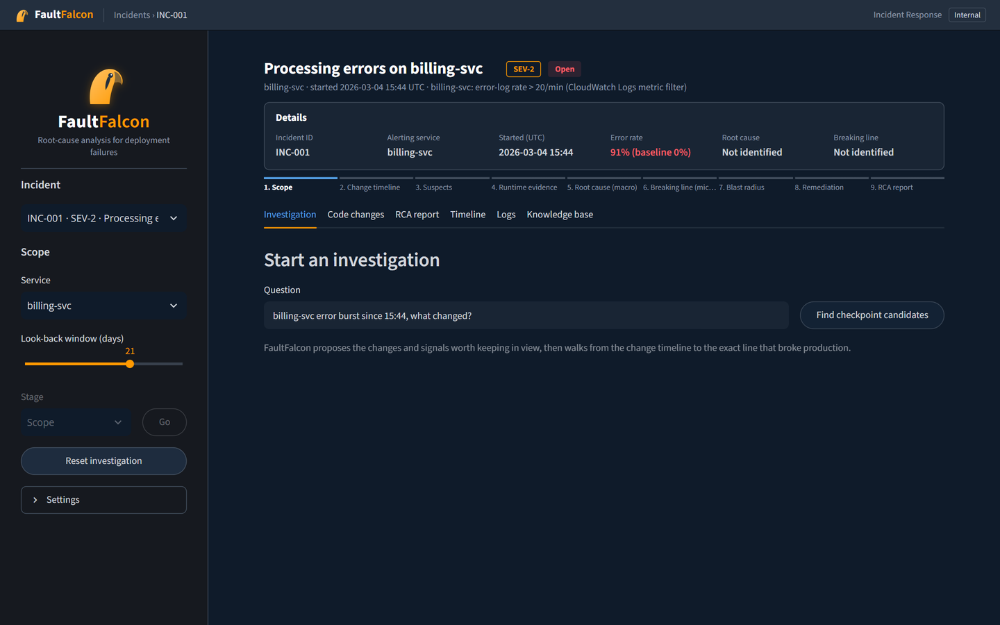

The left panel lists all 120 incidents and sets the scope: the service under investigation and how far back
to look (21 days). The header shows the incident as an on-call engineer first sees it: **SEV-2**, **Open**,
the alarm that fired, and the error rate against its baseline. *Root cause* and *Breaking line* are still
**Not identified**. The progress bar below lists the nine stages of the investigation.

## 2. Choose checkpoints

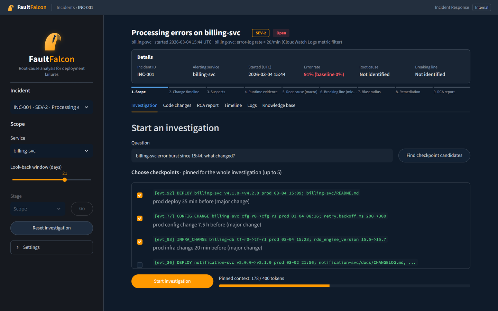

The engineer starts from a plain question (*"billing-svc error burst since 15:44, what changed?"*) and
clicks **Find checkpoint candidates**. FaultFalcon proposes the changes and signals worth keeping in view:
a `billing-svc` deployment 35 minutes before, a config change that morning, a database engine upgrade 20
minutes before, and more. The ticked items are **pinned** for the whole session: they sit in the model's
never-evicted *anchor block*, so they are not forgotten however long the investigation runs. The bar shows
how much of the pinned-context budget they use (178 of 400 tokens).

## 3. The first step: the change timeline

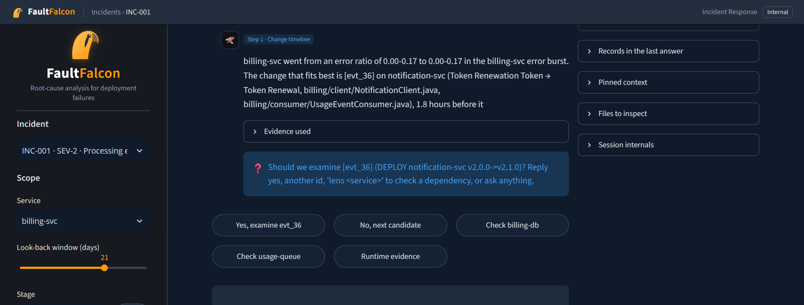

After **Start investigation**, each step has the same shape: a short answer citing record ids
(`evt_…` for events, `chg_…` for code changes), an **Evidence used** panel listing exactly what was
retrieved, and **one question** with buttons for the likely replies. The engineer can also type any reply
or question in the box below.

The first candidate is a `notification-svc` deployment. The buttons also offer to follow the dependencies
of `billing-svc`: its database (`billing-db`) and the queue it reads from (`usage-queue`). The panel on the
right keeps the findings, the pinned context and the files to inspect.

## 4. Following the dependency

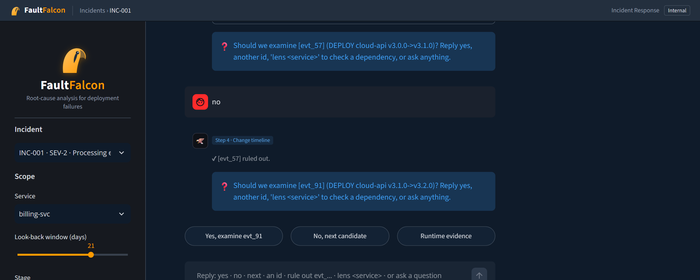

The engineer rules out the `notification-svc` deployment and, at the next candidate (a `billing-svc`
deployment), clicks **Check usage-queue** instead. Looking at the
queue brings in the services that publish to it, so the candidates are now `cloud-api` deployments.
After ruling out an older one (`evt_57`), FaultFalcon asks about **`evt_91`: DEPLOY cloud-api
v3.1.0 → v3.2.0**, the deployment 42 minutes before the alert.

## 5. Root cause, then the breaking line


At the *Suspects* stage FaultFalcon asks whether `evt_91` is the root cause. The engineer answers **yes**.
It is recorded in the findings ledger as the confirmed root cause, and the investigation drills into
that deployment's diff.

The suspect-line ranker scores every changed hunk in the deployment and puts
**`chg_71`: `cloud-api/nova/usage/publisher.py:348`** first. That is the line where the usage event's
`instance_type` field was replaced by a nested `flavor` object.

**Note on the model's wording.** The model's sentence at step 5 contradicts itself (it calls `evt_91`
"ruled out" and then asks to confirm it), and at step 6 it quotes the wrong line of code. This is the
360M-parameter model's weakness. The ids, file and line number in the question come from retrieval and
the deterministic ranker, not from the model's sentence, and the engineer's confirmation is what goes into
the report. The [README](README.md#status-and-limitations) lists this under limitations.

## 6. Blast radius

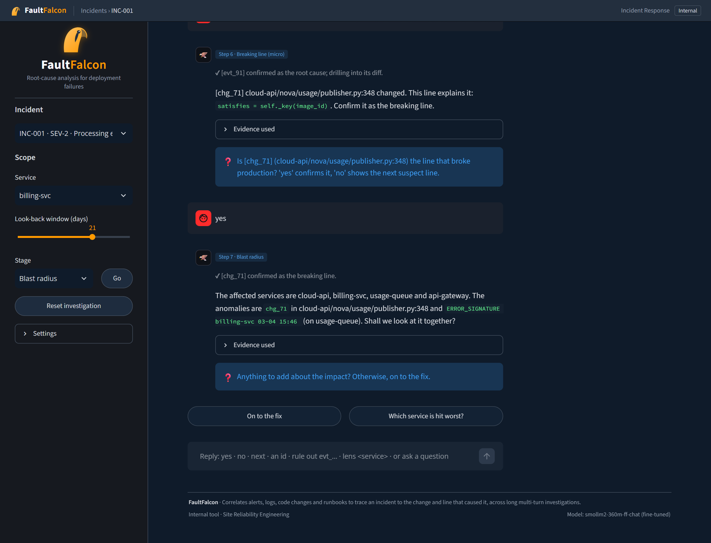

With `chg_71` confirmed as the breaking line, FaultFalcon walks the service topology to find who is
affected: `cloud-api` itself, `usage-queue`, `billing-svc` and `api-gateway`, with the error signature
seen on `billing-svc` at 15:46.

## 7. Remediation and closing the investigation

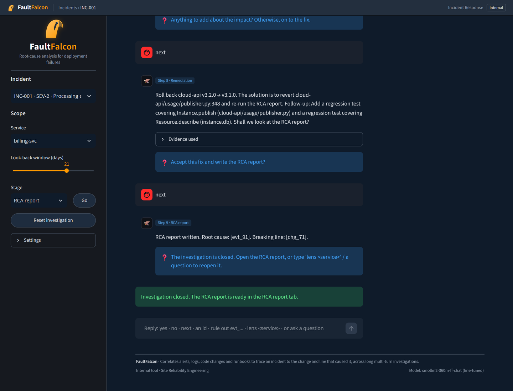

The remediation step proposes **rolling back cloud-api v3.2.0 → v3.1.0** (reverting
`publisher.py:348`) and adds follow-ups: regression tests for the publisher and its consumers. The
engineer accepts, and the investigation closes: *"RCA report written. Root cause: evt_91. Breaking line:
chg_71."* That matches the known answer for INC-001.

Nine steps in total. The engineer clicked a button at every step and never had to type an id.

---

## The evidence tabs

### RCA report

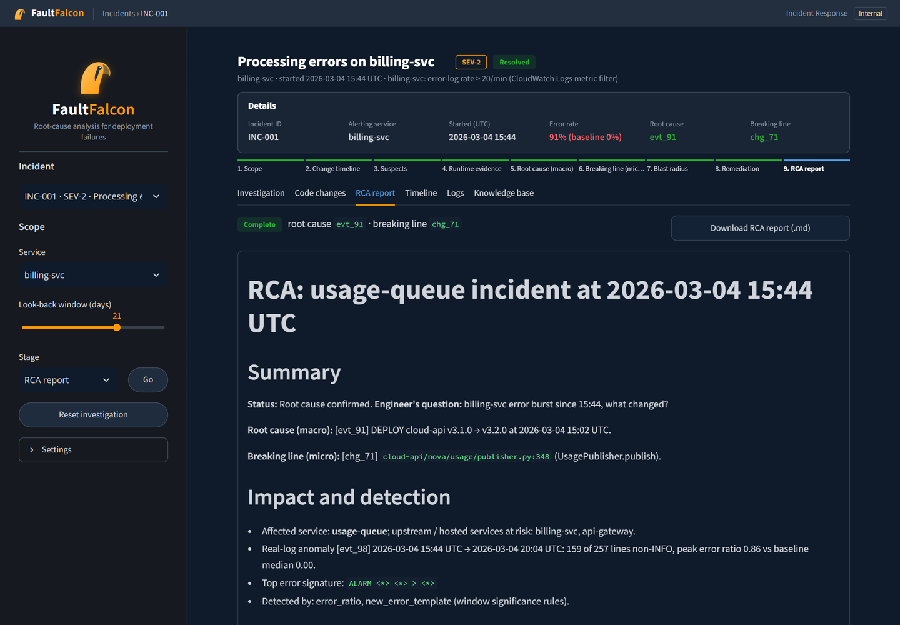

The header now shows **Resolved**, with root cause `evt_91` and breaking line `chg_71` in green, and the
stage bar complete. The report is built from the findings ledger only, never from free model text:
summary, impact and detection (affected services, the log anomaly, the top error signature),
timeline, root cause, the breaking line with its diff, what was ruled out, remediation and action items.
**Download RCA report (.md)** saves it as a Markdown file.

### Code changes

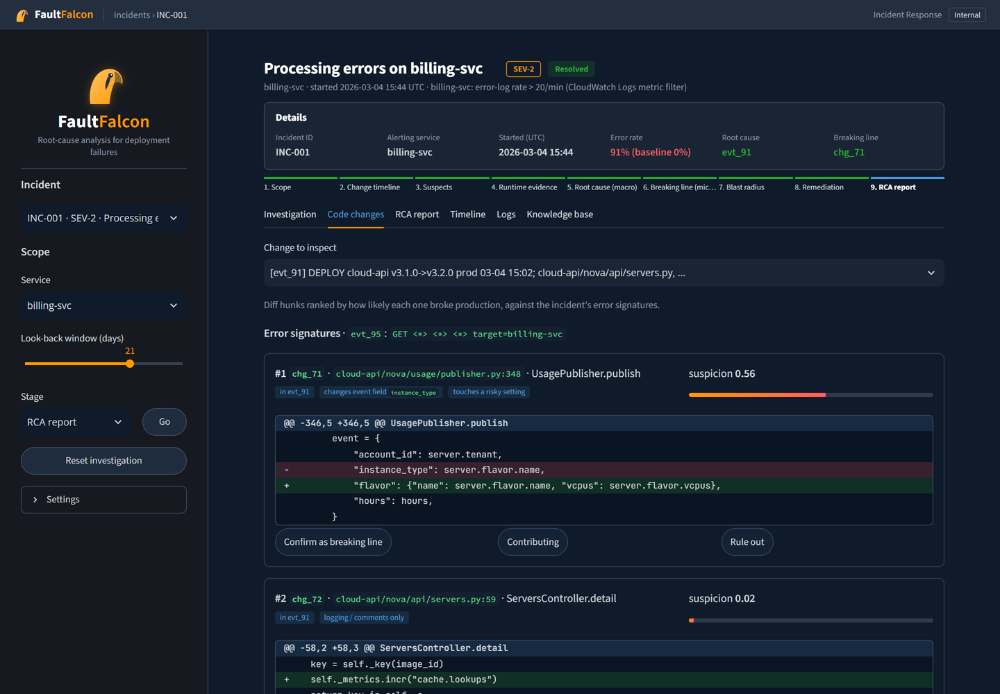

Every hunk of the selected change, ranked by how likely it broke production against the incident's error
signatures. The culprit scores **0.56** (*changes event field `instance_type`*, *touches a risky
setting*), and the next hunk, a logging-only change, scores 0.02. The engineer can confirm a hunk as the
breaking line, mark it contributing, or rule it out.

### Timeline

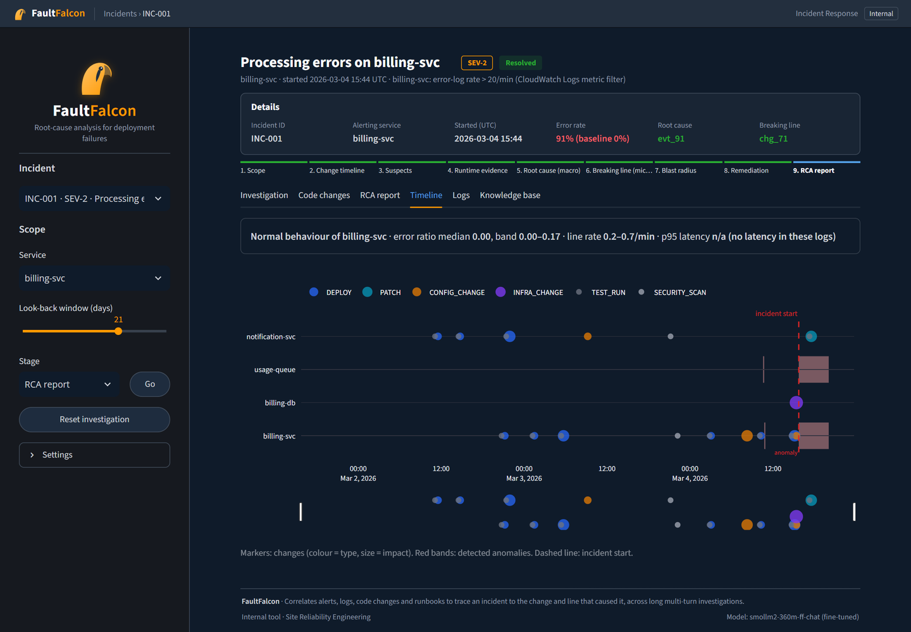

All changes around the incident on the affected services: deploys, patches, config changes,
infrastructure changes, test runs and security scans (marker size = impact), with the detected anomalies as
red bands and the incident start as a dashed line. The strip above it gives the service's normal behaviour
(error-ratio baseline and line rate; there is no latency metric because these logs do not contain one).

### Logs

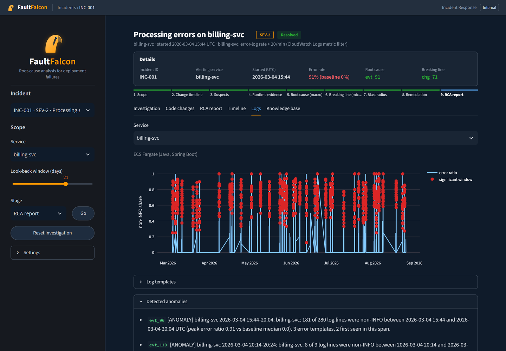

The error ratio of the service's logs over six months, with the windows the detector flagged as
significant, the log templates (Drain3) and the list of detected anomalies with their numbers. The
first anomaly listed (`evt_96`) is this incident: 181 of 280 log lines were errors between 15:44 and
20:04.

### Knowledge base

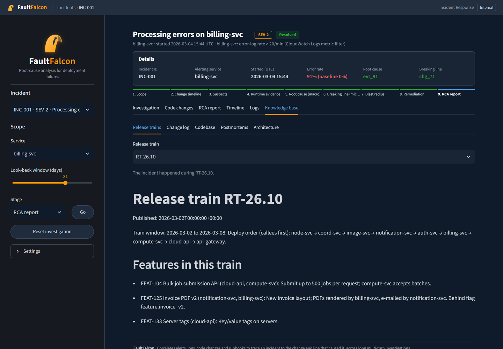

The team documents the assistant searches: release-train plans (features, deploy order), daily change
logs, codebase guides, postmortems of earlier incidents and the architecture. Every document has a
publish date, and the assistant only reads documents published before the incident started.

---

## Try it yourself

Follow [Run the demo](README.md#run-the-demo) in the README, open INC-001 (selected by default), and reply
the way this example does:

| Step | Click |
| --- | --- |
| Checkpoints | **Find checkpoint candidates** → **Start investigation** |
| 1 | **No, next candidate** (rules out the `notification-svc` deployment `evt_36`) |
| 2 | **Check usage-queue** (follow the dependency) |
| 3 | **No, next candidate** (rules out the older cloud-api release `evt_57`) |
| 4 | **Yes, examine evt_91** |
| 5 | **Yes, evt_91 is the root cause** |
| 6 | **Yes, chg_71 is the breaking line** |
| 7 | **On to the fix** |
| 8 | **Yes, write the RCA report** |

Then open the **RCA report** tab. *Settings → Show resolution* reveals the known answer for comparison.
Other incidents take different paths (config changes, Terraform changes, database migrations, external
causes); try any of the 120.

The model's wording varies from run to run. The records it is asked about, the ranking and the final report
come from retrieval and the ledger, so they do not change.
