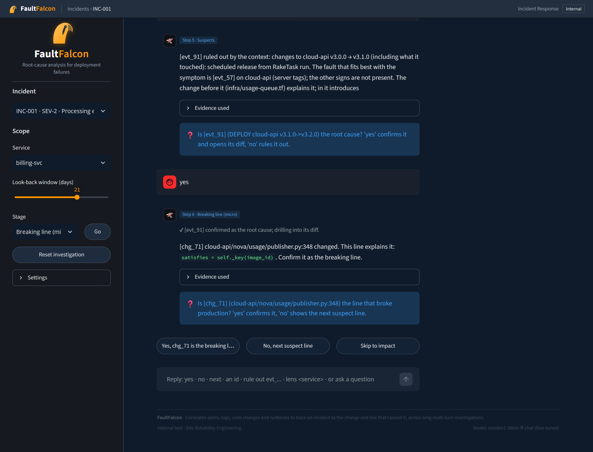
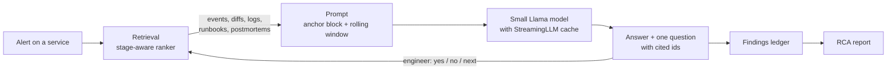

<p align="center">
  
</p>

<h1 align="center">FaultFalcon</h1>

<p align="center">
  <b>A conversational root-cause-analysis assistant for deployment failures</b><br>
  Traces an incident from the alert to the change and the exact line of code that caused it,
  over a long multi-turn investigation, on a laptop CPU.
</p>

> **Prototype, in active development.** FaultFalcon is a research and portfolio prototype, not a production
> tool. It runs on a prebuilt dataset of a simulated cloud platform (details in [The data](#the-data)), and
> its interface, models and evaluation are still changing.

<p align="center">
  
</p>

**See a full demo run with screenshots: [EXAMPLE.md](EXAMPLE.md)**

---

## Contents

- [What it does](#what-it-does)
- [How it works](#how-it-works)
- [Run the demo](#run-the-demo)
- [Using the app](#using-the-app)
- [The data](#the-data)
- [The model](#the-model)
- [Project structure](#project-structure)
- [Tech stack](#tech-stack)
- [Status and limitations](#status-and-limitations)
- [Troubleshooting](#troubleshooting)

## What it does

When a production alert fires, an on-call engineer has to answer three questions quickly: *what changed*,
*which change broke it*, and *where exactly*. FaultFalcon works through them with the engineer, one step at
a time, the way an SRE team runs an incident review:

1. **Scope:** the alerting service, the time window and the error rate against its normal baseline.
2. **Change timeline:** deployments, hotfixes, config and infrastructure changes around the incident.
3. **Suspects and runtime evidence:** the candidate changes, their tests, anomalies and error signatures
   in the logs, runbooks and past postmortems. It follows dependencies across services
   (e.g. `billing-svc` → `cloud-api`).
4. **Root cause:** the one change that caused the incident.
5. **Breaking line:** the changed code, config or Terraform line inside that change, ranked by suspicion.
6. **Blast radius and remediation:** which services are affected and how to fix it (rollback, revert, code fix).
7. **RCA report:** a written root-cause-analysis report with timeline, diff, impact and action items.

The engineer stays in control: FaultFalcon proposes, the engineer confirms or rules out, and every claim in
an answer must cite a record (`evt_…` event or `chg_…` code change) it actually retrieved.

## How it works



- **Long sessions on a small model: StreamingLLM.** An investigation runs for dozens of turns, far beyond
  what a small model can hold. FaultFalcon uses the original
  [StreamingLLM](https://github.com/mit-han-lab/streaming-llm) technique (attention sinks + a rolling
  window of recent tokens), extended with an **anchor block**: the engineer's question, the pinned
  checkpoints and the confirmed findings stay in a start region that is never evicted, while fresh
  evidence rolls through the window.
- **Grounded retrieval.** A stage-aware ranker pulls the right records for each step from SQLite and a
  ChromaDB vector index: change events, diff hunks, log anomalies, error signatures and team documents. It
  never returns a document published after the incident started, so the assistant cannot "see the answer".
- **Deterministic safety rails.** Suspect lines are ranked by explicit rules (what kind of change, how risky),
  citations are checked against what was retrieved, and the engineer's confirm / rule-out decisions are
  kept in a ledger. The RCA report is built from the ledger only.
- **Fine-tuned for the job.** The default model (SmolLM2-360M-Instruct) is fine-tuned with LoRA on
  investigation dialogues so it answers briefly, cites records and asks one question per step.
- **Optional LangGraph orchestration** of the same steps, with pause-and-resume.

## Run the demo

Everything the app needs is in this repository, except the fine-tuned model, which is too large for GitHub
and is shared on Google Drive. The dataset, the database and the search index are **prebuilt**, so nothing
is generated on your machine.

### Requirements

| | |
| --- | --- |
| OS | Windows 10/11, macOS or Linux |
| RAM | 8 GB minimum (the app uses about 3 GB) |
| Disk | about 4 GB free (Python environment 2 GB, model 0.7 GB, project 0.1 GB) |
| Software | [git](https://git-scm.com/downloads) and [uv](https://docs.astral.sh/uv/) (installs Python 3.10 for you) |
| Internet | only for the first run (installs packages) |
| GPU | not needed |

### Step 1: install git and uv (once)

- **git:** download from https://git-scm.com/downloads and install with the defaults.
- **uv** (a fast Python installer; it downloads the right Python version by itself):

  Windows (PowerShell):
  ```powershell
  powershell -ExecutionPolicy ByPass -c "irm https://astral.sh/uv/install.ps1 | iex"
  ```
  macOS / Linux:
  ```bash
  curl -LsSf https://astral.sh/uv/install.sh | sh
  ```

  Close and reopen the terminal afterwards so `uv` is on the PATH. Check with `uv --version`.

### Step 2: get the code

```bash
git clone https://github.com/<your-user>/<repo-name>.git
cd <repo-name>
```

(Or on GitHub: **Code → Download ZIP**, then unzip it.)

### Step 3: download the fine-tuned model

| File | Size | Download |
| --- | --- | --- |
| `smollm2-360m-ff-chat.zip` (the fine-tuned model) | ~0.7 GB | **[Google Drive](https://drive.google.com/file/d/1tTU9WJ1LXxBtItiR3lRd9GAuqwm8r9FF/view?usp=drive_link)** |

Unzip it into the `models/` folder of the project so that this file exists:

```
<repo-name>/
└── models/
    └── smollm2-360m-ff-chat/
        ├── config.json
        ├── model.safetensors
        ├── tokenizer.json
        └── ...
```

Create the `models` folder if it is not there. Be careful that unzipping does not add an extra folder level
(`models/smollm2-360m-ff-chat/smollm2-360m-ff-chat/...` will not be found).

> **Skipping this step also works:** without the fine-tuned model the app downloads the base
> SmolLM2-360M-Instruct model from Hugging Face on the first run and uses it instead. The answers are
> less focused, but the whole app works.

### Step 4: run

**Windows:** double-click `run.bat` (or run `.\run.bat` in a terminal inside the project folder).

**macOS / Linux:**
```bash
chmod +x run.sh
./run.sh
```

**The first run** creates the Python environment in `.venv/` and installs the packages (PyTorch,
transformers 4.33, StreamingLLM, ChromaDB, Streamlit…). This takes about 5 minutes and ~2 GB of downloads.
**Every later run starts in a few seconds.**

The app opens in your browser at **http://localhost:8501**. The terminal prints which model is in use:

```
Model: smollm2-360m-ff-chat (fine-tuned). Data: 120 incidents.
```

The page footer shows the same (`Model: smollm2-360m-ff-chat (fine-tuned)`). Stop the app with **Ctrl+C**
in the terminal.

### Options

```bash
run.bat --port 8600          # another port (./run.sh --port 8600 on macOS / Linux)
run.bat --no-browser         # do not open a browser tab
run.bat --check              # print the model and data status, then exit
```

To force the base model even when the fine-tuned one is present, set `FF_BASE_MODEL=1` before running
(`set FF_BASE_MODEL=1` in cmd, `$env:FF_BASE_MODEL=1` in PowerShell, `FF_BASE_MODEL=1 ./run.sh`).

## Using the app

A full walkthrough with screenshots is in **[EXAMPLE.md](EXAMPLE.md)**. In short:

1. **Pick an incident** in the left panel (120 incidents; each shows its id, severity and title). On a
   narrow window, open the panel with the **» Incidents** button.
2. **Start an investigation:** keep or edit the question, click **Find checkpoint candidates**, tick the
   changes and signals you want pinned for the whole session, then **Start investigation**.
3. **Answer the guided questions.** Each step gives a short answer with cited ids and asks one question,
   e.g. *"Is chg_71 the line that broke production?"*. Click an option, or type a reply:

   | Reply | Effect |
   | --- | --- |
   | `yes` / `no` | accept the candidate / rule it out and see the next one |
   | `next` | move on to the next stage |
   | `evt_91`, `chg_71` | look at that record instead |
   | `lens cloud-api` | follow a dependency to another service |
   | `report` | finish and write the RCA report |
   | anything else | a question, answered within the current step |

4. **Read the result:** the header fills in *Root cause* and *Breaking line*; the **RCA report** tab has
   the full report. The other tabs show the evidence: **Code changes** (diffs ranked by suspicion),
   **Timeline**, **Logs** and the **Knowledge base**.
5. **Check the answer:** *Settings → Show resolution* reveals the known cause of the incident, so you can
   compare it with what the investigation found. *Reset investigation* starts over.

## The data

FaultFalcon needs incidents whose true cause is known down to the line, which real companies do not
publish. So the dataset is a **simulated managed-compute platform on AWS** built around **real logs**:

- **Real logs:** samples from [LogHub](https://github.com/logpai/loghub) (OpenStack, Hadoop, HDFS,
  Zookeeper, BGL) are used unmodified for five components. Anomalies, error signatures and baselines are
  detected from the log lines by the project's own detector.
- **Synthetic telemetry:** logs for the other components are generated in each component's native log
  format.
- **Simulated engineering history** (seeded, reproducible): six months of release trains, hotfixes,
  database migrations, config changes and Terraform changes, each stored as real diff hunks with a change
  request and description; test runs and security scans; and a team knowledge base (release plans,
  daily change logs, codebase guides, runbooks, postmortems) with publish dates.
- **120 incidents** across 15 components (API Gateway, auth service, control plane, compute / storage
  stack, billing with an SQS queue, notifications, RDS databases, ElastiCache…), covering about 50 failure
  types in code, config, infrastructure, data migrations and external causes. Each has a known root-cause
  change, breaking line, decoy changes and remediation. 96 are used for development and fine-tuning, 24
  are held out for evaluation.

In the app everything is presented as the platform's operational data. More detail:
[data/README.md](data/README.md).

## The model

| | |
| --- | --- |
| Base model | [HuggingFaceTB/SmolLM2-360M-Instruct](https://huggingface.co/HuggingFaceTB/SmolLM2-360M-Instruct) (Llama architecture, open weights) |
| Fine-tuning | LoRA (rank 16) on conversational investigation dialogues from the 96 development incidents, merged into the weights; trained on a free Colab T4 GPU ([Fine-Tuning Notebook](Fine-Tuning%20Notebook/lora_colab.ipynb)) |
| Inference | CPU, a manual token loop with the StreamingLLM cache (transformers 4.33) |
| Embeddings | all-MiniLM-L6-v2 (ONNX, via ChromaDB), downloaded automatically on the first run |

No paid APIs and no API keys: everything runs locally with open-source libraries and open-weights models.

## Project structure

```
├── app/                   Streamlit web app (UI, theme, logo)
├── ff/                    the engine
│   ├── engine/            investigation session, guided Q&A, stages, findings ledger, RCA report, LangGraph flow
│   ├── retrieve/          stage-aware ranker and suspect-line (diff) ranker
│   ├── llm/               model loading, chat format, StreamingLLM cache and generation loop
│   ├── store/             SQLite store and ChromaDB vector index
│   ├── ingest/            how the dataset, logs, telemetry and knowledge base were generated
│   ├── eval/              evaluation reports shown in the app
│   ├── config.py          platform topology, model selection, all settings
│   └── launch.py          one-command start (used by run.bat / run.sh)
├── data/                  the dataset: incidents, log lines, history (see data/README.md)
├── docs/architecture/     the team knowledge base the assistant searches
├── var/                   prebuilt database (SQLite) and search index (ChromaDB)
├── models/                the fine-tuned model goes here (download from Google Drive)
├── Fine-Tuning Notebook/  Colab notebook used to fine-tune the model
├── requirements.txt       pinned Python dependencies
├── run.bat / run.sh       start the app
└── EXAMPLE.md             a demo run with screenshots
```

## Tech stack

Python 3.10 · PyTorch 2.1 (CPU) · transformers 4.33 · [mit-han-lab/streaming-llm](https://github.com/mit-han-lab/streaming-llm)
· SmolLM2-360M (LoRA fine-tuned) · ChromaDB + all-MiniLM-L6-v2 · SQLite · Drain3 (log templates) ·
LangGraph · Streamlit · Plotly · uv

## Status and limitations

This is a **prototype in development**. Current state:

- **Works:** the full guided investigation on all 120 incidents, the RCA report, evidence tabs, the
  fine-tuned model and the StreamingLLM cache on a laptop CPU.
- **Measured so far:** with StreamingLLM the small model keeps a perplexity of 1.56 on a 4,000-token
  session, against 29.67 for a plain sliding window without attention sinks. Given the root-cause change,
  the suspect-line ranker puts the true breaking line first in 95% of incidents and in the top 3 in all of
  them.
- **Limitations:**
  - The platform, its changes and most of its logs are simulated; only five components use real logs.
    FaultFalcon has not been connected to a real repository, CI system or cloud account.
  - The model is small (360M parameters). Its own sentences can be wrong or cite the wrong record; the
    retrieval, the deterministic line ranking, the citation check and the engineer's confirmations keep
    the investigation on track.
  - The log anomaly detector is simple, and the held-out evaluation set is small (24 incidents).
  - Answers take a few seconds per step on a CPU.
- **Next:** more agentic behaviour (the assistant choosing its own next lookup), evaluation on more
  held-out incidents, and connectors for real change data (git history, CI, CloudWatch).

## Troubleshooting

| Problem | Fix |
| --- | --- |
| `uv is needed once…` | Install uv (Step 1), then open a **new** terminal and run again |
| `'run.bat' is not recognized` | Run it from inside the project folder as `.\run.bat`, or double-click it |
| Footer says `SmolLM2-360M-Instruct` instead of `(fine-tuned)` | The model is not at `models/smollm2-360m-ff-chat/config.json`; check for an extra folder level after unzipping |
| First run fails while installing | Check your internet connection and that git is installed (one package is installed from GitHub), then run again |
| Port 8501 is already in use | `run.bat --port 8600` and open http://localhost:8600 |
| The first answer is slow | The model loads once (a few seconds); later steps are faster |
| Left panel (incident list) is not visible | Widen the window or click **» Incidents** below the top bar |

---

<sub>FaultFalcon · a prototype by Prathamesh Deshpande. Uses LogHub log samples, the SmolLM2 model and the
StreamingLLM method under their respective licenses.</sub>
