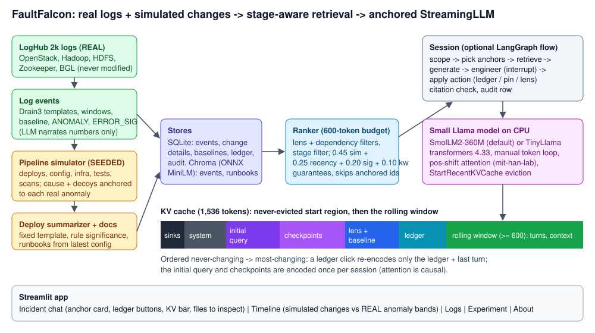

# FaultFalcon architecture

## 1. Data: a simulated AWS platform, real and synthetic logs, simulated changes

The company runs a managed-compute platform on AWS with 15 components (`config.COMPONENTS`): an edge
(API Gateway + ALB), auth-svc (Go on ECS) with an ElastiCache session cache, cloud-api (the control plane,
OpenStack logs), image-svc (Go) over S3, compute-svc / storage-svc / coord-svc / node-svc (Hadoop, HDFS,
ZooKeeper, BGL logs), billing-svc (Spring Boot) fed by an SQS queue from cloud-api, notification-svc
(Lambda + SES), and two RDS PostgreSQL databases. Edges follow AWS patterns (synchronous calls only where a
request needs an answer, a queue between metering and billing, one database per bounded context, a
read-through cache, stateful services on the EC2 fleet). `dependency_path` follows calls, hosts and
"queue fed by producer" edges, so a billing-svc alert can lead to a cloud-api change.

| Record | Source | How |
| --- | --- | --- |
| Log lines | real LogHub (5 components, last 72 h) + synthetic telemetry (all components, six months) | `ff/ingest/telemetry.py`: native formats (ALB access, Go JSON, logback, Lambda, PostgreSQL, Redis, CloudWatch, S3 access); LogHub components reuse real lines as normal traffic |
| ANOMALY | detector on both streams, separately | Drain3 templates, windows (real: `max(5 min, span/150)`; synthetic: 10 min per contiguous segment), two-pass baseline, significance rules, adjacent windows merged into spans |
| ERROR_SIGNATURE | detector | one per non-INFO template (plus BGL alert labels) per span, most frequent first, 3 redacted exemplars |
| Baseline (1 per component) | detector | bands `[p10, p90]` of rate / error ratio / p95 latency (cloud-api, api-gateway) over unflagged windows |
| DEPLOY / PATCH / ROLLBACK / CONFIG / INFRA / TEST_RUN / SECURITY_SCAN | seeded simulator | six months: background config / Terraform changes of every component, 26 weekly release trains (callee first), hotfixes, incident causes, decoys and mitigations; each change has a change request + natural-language description (`ff/ingest/describe.py`) |
| Incidents (100) | `ff/ingest/plan.py` + scenarios | ~10 on real LogHub anomalies, the rest planned (scenario, cause component, alerting component, time, mitigation); 80 dev / 20 held out, stratified by scenario |

Pipeline (`ff/ingest/dataset.py`): real anomalies -> incident plan -> synthetic telemetry -> detector on both
streams -> link each planned incident to the anomaly found on its alerting component (the incident starts
there) -> simulator places the changes behind every incident -> descriptions -> chronological renumbering
(`evt_N`, `chg_N`, `INC-NNN`) so an id reveals nothing about which event is the cause.

The LLM never produces data: it only narrates computed numbers, and a narrative containing any number absent
from its input is replaced by a template sentence. Deployment narratives use a fixed template; significance
(1-5) is rule-based.

## 2. StreamingLLM, done properly

`ff/llm/streaming.py` wraps the original mit-han-lab code:

- `StartRecentKVCache(start_size, recent_size)` keeps the first `start_size` tokens and the last `recent_size`.
- `enable_llama_pos_shift_attention` caches keys before RoPE and rotates them by their position *inside the
  cache*, so evicting middle tokens leaves no position gaps. The patch sets an instance `forward` on each
  `LlamaAttention`; the `pos_shift(model, enabled)` context manager toggles it, so one copy of the weights
  serves both the unpatched (full / trim) and patched (streaming / window / faultfalcon) modes.
- Generation is a manual token loop (`ff/llm/model.py::generate`): `make_room` before prefill, prefill in
  chunks of at most `recent_size // 2` (with `make_room` before each), greedy decode with `make_room(1)` per
  token, batch 1, `attention_mask=None`. `model.generate()` is never used with a streaming cache.

Proven by tests on a tiny random Llama with grouped-query attention (`tests/test_streaming.py`): patched ==
unpatched logits without eviction (atol 1e-4), capacity holds after 3x overflow, sink keys byte-identical.

## 3. The anchor block

`AnchoredStreamingCache` makes the protected start region a list of named segments, ordered from
never-changing to most-changing:

| # | Segment | Changes when | Budget |
| --- | --- | --- | --- |
| 1 | sinks (first 4 tokens) | never | 4 |
| 2 | system rules | never | 120 |
| 3 | initial query (verbatim) | never | 100 |
| 4 | checkpoints (<= 5, compressed) | pin / unpin | 300 |
| 5 | lens + baseline | lens redirect | 120 |
| 6 | ledger | Confirm / Refute / Ruled out | 200 |
| - | rolling window | every turn | >= 600 |

Attention is causal, so when segment *k* changes, segments before *k* stay exactly valid:
`update_segment(k)` calls `evict_range(offset_k, cache_len)`, re-prefills segments *k..6* and the last turn.
Tests check both halves: the earlier segments are byte-identical, and the rebuilt cache equals a from-scratch
cache (atol 1e-4). A ledger click re-encodes ~200 tokens + the last turn; the initial query and checkpoints are
encoded once per session.

In the FaultFalcon modes the anchor block is part of the system turn (it lives in the start region). In the
other modes the same text is the first user message, so every mode starts from the same information; only
what happens to it later differs.

The first 4 tokens do the attention-sink job. The anchor tokens are kept because of where they sit, not
because the model pays them sink-level attention. Experiment B (B4 vs B5) measures whether keeping them helps.

## 4. Retrieval

`ff/retrieve/ranker.py`, budget 600 tokens (counted with the model's tokenizer):

1. Hard filters: lens service + direct dependencies + host; `[incident - 21 d, incident + 2 h]`.
2. Stage filter: CHANGE_TIMELINE = prod changes; SUSPECTS = focus change + all TEST_RUNs of its release +
   its scan; RUNTIME = ANOMALY / ERROR_SIGNATURE (+ runbooks); HYPOTHESIS / CLOSE = ledger ids + top anomaly.
3. Candidates: top 25 by exact cosine similarity, plus exact matches (templates or file / symbol / param names
   named in the question).
4. `score = 0.45 sim + 0.25 exp(-dt/tau) + 0.20 significance/5 + 0.10 keyword`, tau 2 d / 14 d / 60 d.
5. Guarantees (details in section 6): the 2 most recent major changes of the lens service, the latest change to
   each of its infra resources, and the most recent major change of each dependency / host.
6. Greedy packing into slots (guaranteed 35% / scored 45% / architecture 20%), chronological order, one
   structural summary per change ("1 file, 1 lines; disk_gb 750 -> 150; ppd load tests skipped").
7. Anchored checkpoint ids are never returned (they are already in the cache); their explanations are tagged.

## 5. Conversation engine

`Session` runs one of five cache modes with the same code: `full`, `trim`, `streaming`, `faultfalcon`,
`ff_no_anchor`. A turn: commands -> retrieve -> user turn (stage instruction + context + question) -> manual
generation -> citation check (`[evt_x]` not in retrieved / anchored / ledger ids becomes `[unverified evt_x]`)
-> ledger suggestions -> audit row in SQLite.

The ledger is driven by UI buttons (the source of truth); model lines "RULED OUT:" / "NEXT CHECK:" citing ids
from the context only become suggestions to accept.

`ff/engine/graph.py` wraps the same functions in LangGraph (no LangChain): `scope -> pick_anchors (interrupt) ->
retrieve -> generate -> engineer (interrupt) -> apply_action -> (retrieve | engineer | close)`. The KV cache is
never in graph state; `cache_registry.get_or_rebuild(state)` rebuilds the start region after a restart. The
experiments call `Session` directly, so timings measure the model and cache, not orchestration.

## 6. Deployment cycles, code-level changes and the knowledge base

The simulator models a product's delivery process, not isolated changes:

- **Release trains** (`ff/ingest/cycles.py`): 26 weekly cycles `RT-26.10` … `RT-26.35`. Each ships 2–4 of
  35 catalog features (ticket, title, services, optional flag). The services a feature touches deploy to
  prod in dependency order (callees first, one 6-hour slot per level), each release flowing
  ppd → test → prod with test runs. Hotfix patches, rollbacks, DB migrations, config changes (AppConfig) and
  Terraform changes of every component (RDS, ElastiCache, SQS, S3, IAM, API Gateway, ALB, ECS, ASG, Lambda,
  EBS) happen in between.
- **Code level** (`ff/ingest/repo.py`): every change is a set of diff hunks over the service's code files,
  build manifest, DB migrations, `config/<svc>.yaml` and `infra/<component>.tf` (real HCL: parameter groups,
  `jsonencode` redrive policies, IAM policy documents, lifecycle rules). Parameters always sit on the same line
  of their file; their old/new values come from a chronological replay. After every incident the team
  mitigates at `mitigated_at`: a rollback for code causes, a revert for config / infra causes (contributing
  changes are reverted a little later).
- **Change requests** (`ff/ingest/describe.py`): each change has a structured record (CHG id, author, approver,
  risk, rollout, rollback plan, resources) and a description (what shipped and how, which bug a hotfix fixes,
  the Terraform plan and why). The text never says which change is harmful.
- **Knowledge base** (`docs/architecture/`, indexed in Chroma with a `kind` and a `published` time):
  - `releases/<train>.md`: the train plan (features, services, deploy order), published when the train starts;
  - `changelog/<day>.md`: what shipped that day (deploys with versions and files, patches, migrations,
    config / Terraform changes with old -> new values, rollbacks, post-deploy error rates), published at the
    end of the day;
  - `codebase/<component>.md`: per file: purpose, owner, DB / network connections, config keys read, calls;
  - `postmortems/*.md`: one per incident (published 2-5 days after its mitigation) + older ones;
  - `runbooks/*.md`, `topology.md`, `patterns.md`.

Retrieval only returns documents published before the incident under investigation started. Each stage
retrieves its kind of knowledge into the 20% architecture slot:

| Stage | Knowledge |
| --- | --- |
| scope | topology + patterns |
| change timeline | the train's plan + daily change logs |
| suspects | codebase + change logs |
| runtime / hypothesis | runbook + earlier postmortems |
| diff analysis | codebase guide for the suspect files |
| blast radius | topology + patterns |
| remediation | earlier postmortems + runbook |

## 7. Macro → micro, across services

- **Macro** (which change?): SCOPE → CHANGE_TIMELINE → SUSPECTS → RUNTIME → HYPOTHESIS. The hard filter
  is the lens service + dependencies + host, so a culprit two hops away (the CROSS_SERVICE scenario) is
  invisible until the engineer moves the lens (`lens compute-svc`, then `lens storage-svc`). The app
  suggests those hops, and replay / walkthrough take them. Each hop rebuilds only the lens + ledger
  segments of the KV cache.
- **Drill:** Confirm on a change marks it `CONFIRMED`, sets the lens focus and moves to DIFF_ANALYSIS, in
  one start-region rebuild.
- **Micro** (`ff/retrieve/diff_ranker.py`): the change's hunks, plus hunks elsewhere that read a flag the
  change flipped (dormant code), are scored against the real error evidence:
  `0.35 magnitude + 0.30 concept overlap + 0.20 risky tokens + 0.15 file relevance`. Reasons are shown,
  and the context ends with a "top suspect line" summary (small models echo what is nearest the question).
  BLAST_RADIUS retrieves anomalies of every service upstream of / hosted on the lens service; REMEDIATION
  retrieves the rollback target, contributing changes and past fixes.
- **RCA** (`ff/engine/rca.py`): the report is built from the ledger and the stores only (never the ground
  truth). Its remediation is derived from the confirmed change type (rollback / config revert / terraform
  restore / code fix), and its action items from the evidence (skipped suites, risky config, infra,
  regression test, alerting).

## 8. Deviations from the build prompts, and why

| Prompt said | Implemented | Reason |
| --- | --- | --- |
| TinyLlama-1.1B for everything | **SmolLM2-360M-Instruct by default**; TinyLlama and SmolLM v1 selectable (`FF_MODEL`) | the user asked for a smaller model; all three are Llama-architecture, so the pos-shift patch applies unchanged. SmolLM2 trains on 8,192 tokens, which moves the "past training length" point in the experiments |
| Zephyr prompt only | per-model `ChatFormat` (Zephyr / ChatML) | SmolLM uses ChatML |
| cloud-api p95 above the band | above band x 1.25 with >= 5 latency samples | a `[p10, p90]` band flags ~10% of normal windows by construction (28 false anomalies on the real data) |
| first-seen template is significant | ignored in the first 2 non-empty windows | every template is "new" in the first window |
| top 12 anomalies by severity | severity-ranked round-robin over services, >= 6 h apart per service; ratio term capped at 20 | a zero baseline median makes node-svc ratios infinite, and all 12 incidents would be node-svc |
| CONFIG_CHANGE cause "in the service or its caller" | always in the incident service | the retrieval hard filter (lens + dependencies + host) never sees a caller's change, so such incidents would be unsolvable by construction |
| guarantee "the last 3 significance >= 4 changes" | 2 most recent + latest change per infra resource (+1 per dependency / host) | with "last 3", recent deploys crowd out a disk shrink from 15 days ago; on the real data the latent cause was dropped |
| CHANGE_TIMELINE = all change types | prod changes only (lens environment); SUSPECTS adds the release's ppd/test runs; prod deploys carry per-release test notes | ppd/test deploys cluttered the 600-token budget, while the SKIPPED_TEST evidence lives on the ppd run |
| every engineer action -> retrieve -> generate | ledger / pin clicks return to the engineer pause without regenerating | a CPU answer takes seconds; a click should not force a new answer |
| lens + stage in the lens segment | stage lives in the user turn | a stage jump would otherwise rebuild lens + ledger + tail |
| ledger cap 250 tokens | rendered to fit the 200-token ledger segment | the segment budget is the binding constraint |
| fake id "becomes [unverified]" | `[unverified evt_x]` | keeps the id visible for the engineer |
| Incidents | 100 incidents over six months; ~10 on real LogHub anomalies, the rest on synthetic telemetry | the 2k-line LogHub samples hold ~17 anomalies in 72 hours; realistic incident counts, services (auth, billing, queues, caches, databases) and AWS failure classes need logs the samples do not have. The same detector derives every anomaly, and the real lines stay untouched |
| Knowledge base | release plans + daily change logs + postmortems per incident, each with a publish time; retrieval filters by it | per-cycle release notes written after the fact could reveal the remediation of the incident being investigated |
| LoRA training data retrieval | uses the hash embedding | 300 per-variant stores with ONNX embeddings would take ~25 min; retrieval differs slightly |
| LoRA trainer | own ~60-line LoRA (`ff/train/lora.py`) in the app env, CPU or `--device cuda` | peft/trl need a newer transformers than 4.33; the old Colab path trained in a second environment on the full text. Now one environment, answer-only loss, prompts identical to the runtime cache |
| tests on full LogHub files | tests use a committed 1-in-5 sample of each structured CSV | offline, fast CI; rows are unmodified |
| `CLAUDE.md` rule "no other LLM" | the tiny random Llama exists for tests only | the prompt requires tests that download nothing |
| 12 incidents, 8 dev / 4 held-out | up to 20 (17 with the real anomalies' 6 h spacing), 12 dev / rest held-out | more, longer scenarios were requested |
| changes = files + line ranges | changes = diff hunks (code, YAML, Terraform) with before/after lines | line-level RCA was requested |
| 6 stages ending in CLOSE | 5 macro + 3 micro stages (diff analysis, blast radius, remediation) + CLOSE with a generated RCA report | macro → micro resolution was requested |
| independent per-service releases | weekly release trains, callee-first, with feature tickets, hotfix patches and DB migrations | a full deployment cycle of dependent services was requested |
| architecture docs = runbooks + topology | + release notes, codebase guide, past postmortems, retrieved per stage by kind | "knowledge of the codebase, features and past fixes" was requested |
| retrieval `anomaly in a callee` scenario | + CROSS_SERVICE (culprit two hops away, needs lens hops) and DB_MIGRATION | multi-service, multi-turn resolution was requested |
| harmful changes persist | a remediation revert follows each parameter incident | otherwise a later incident's cause could be a no-op (found by `make verify`) |
